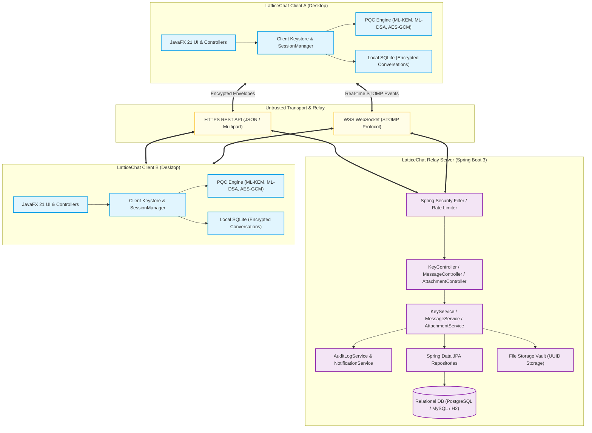
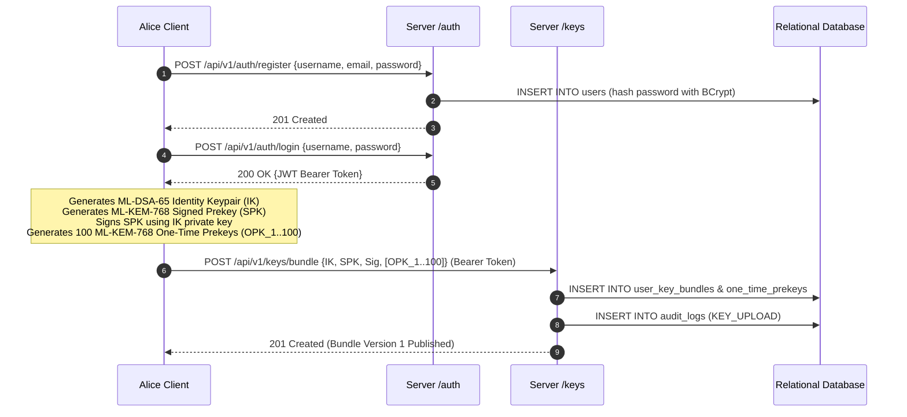
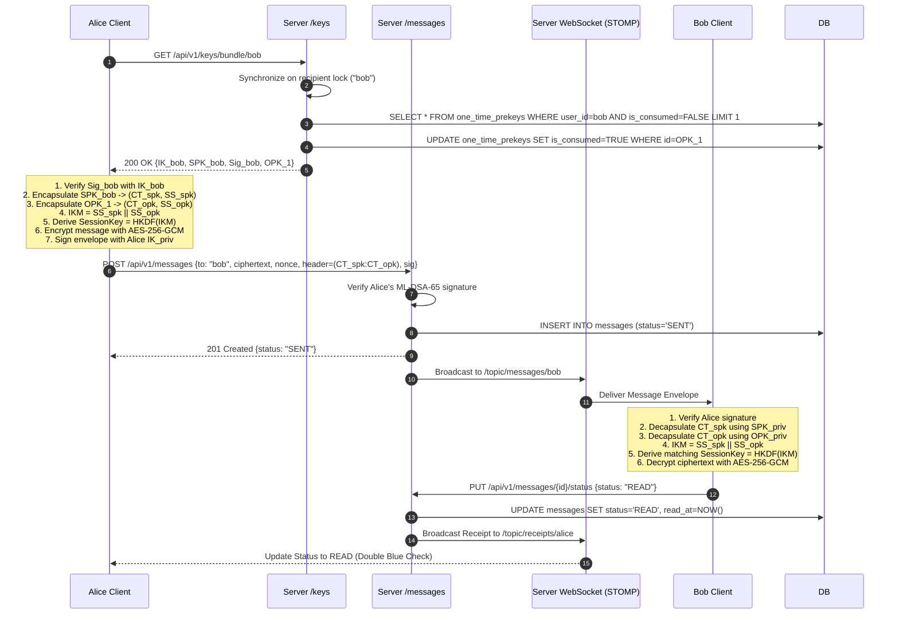
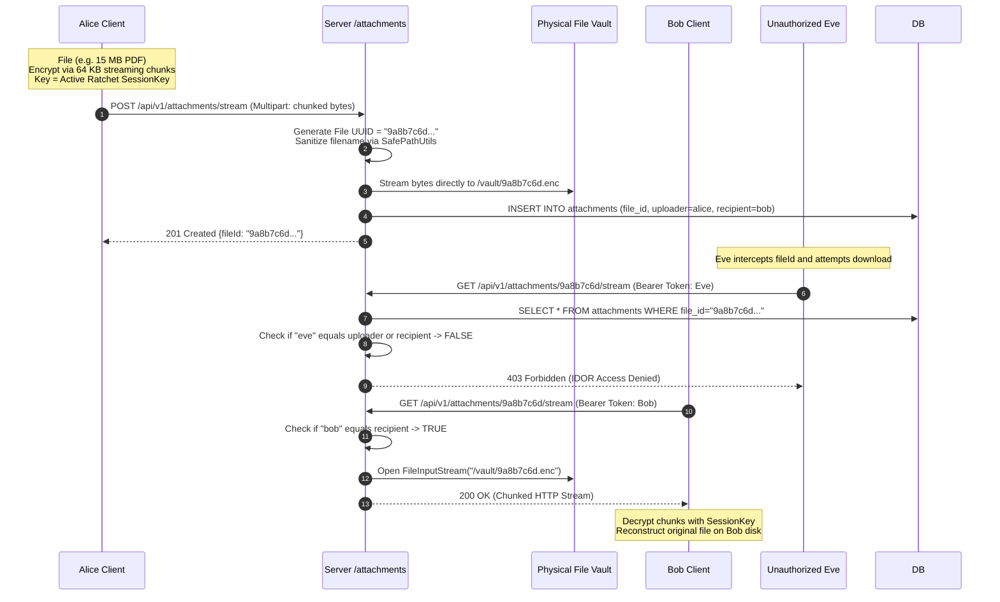
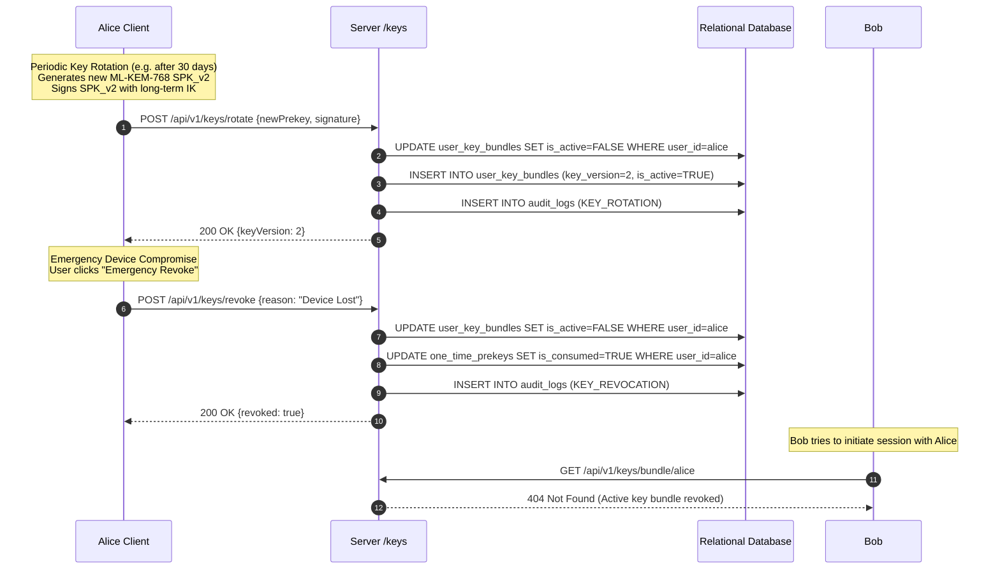

# LatticeChat — System Architecture & Component Engineering

**Architecture Classification**: Multi-Module Distributed Cryptographic System  
**Frameworks**: Java 21 LTS, Spring Boot 3.3, JavaFX 21, Bouncy Castle PQC 1.78.1, SQLite, MySQL / PostgreSQL  
**Author**: Malhar Bhosale  

---

## 1. High-Level Architectural Vision

LatticeChat is built upon the premise that **the network and the relay server must be treated as untrusted, potentially hostile environments**. Confidentiality must not depend upon transport encryption (TLS) alone, nor upon cloud database security.



---

## 2. Multi-Module Reactor Architecture

The project is partitioned into three decoupled modules:

```
LatticeChat (Parent POM)
│
├── secure-chat-common/        <-- Pure Cryptographic Engine & Shared Protocols
│   ├── crypto/                <-- ML-KEM, ML-DSA, AES-GCM, HKDF
│   ├── crypto/stream/         <-- 64 KB Chunking Streaming Engine
│   ├── crypto/benchmark/      <-- High-Resolution Monotonic Benchmarking Suite
│   ├── dto/                   <-- Type-Safe Network Payloads (Records)
│   └── util/                  <-- SafePathUtils & Base64 Encoders
│
├── secure-chat-server/        <-- Zero-Knowledge Blind Relay Hub
│   ├── controller/            <-- REST API Endpoints (Auth, Keys, Messages, Files)
│   ├── service/               <-- Business Logic & Atomic Synchronization
│   ├── repository/            <-- Spring Data JPA Data Access
│   ├── entity/                <-- Zero-Knowledge Database Entities
│   ├── security/              <-- JWT Authentication Filters & Rate Limiting
│   └── websocket/             <-- STOMP Message Broker & Presence
│
└── secure-chat-client/        <-- Sovereign Desktop Application
    ├── controller/            <-- JavaFX UI Controllers (Chat, Lab, Dashboard)
    ├── crypto/                <-- Client In-Memory Keystore & Key Rotation
    ├── protocol/              <-- Double Ratchet State Machine & PQ-X3DH
    ├── storage/               <-- Local SQLite History & Session Serialization
    └── net/                   <-- Reactive HTTP & WebSocket Gateway
```

### Module Responsibilities:
1. **`secure-chat-common`**: Contains zero framework dependencies (pure Java 21 + Bouncy Castle). It guarantees that cryptographic logic is 100% portable and reusable across desktop, server, mobile, or CLI environments.
2. **`secure-chat-server`**: Implements Spring Boot 3 enterprise capabilities: declarative transactions, connection pooling (HikariCP), rate limiting, and zero-knowledge persistence. The server does not link or invoke any decryption routines.
3. **`secure-chat-client`**: Executes the user-facing JavaFX GUI, holds local private keys in non-swappable memory buffers, runs the Double Ratchet engine, and executes real-time cryptographic inspection.

---

## 3. Core Protocol Sequence Flows

### 3.1 Client Registration & Key Bundle Publication



---

### 3.2 PQ-X3DH Session Handshake & First Message Relay



---

### 3.3 Zero-Knowledge Encrypted File Transfer & IDOR Defense



---

### 3.4 Key Rotation & Emergency Invalidation Flow


