# LatticeChat — Relational Database Schema & Data Architecture

**Database Systems**: MySQL 8.0+ / PostgreSQL 15+ / In-Memory H2  
**ORM Layer**: Spring Data JPA / Hibernate 6.5  
**Design Paradigm**: Zero-Knowledge, Append-Only Auditing, Post-Quantum Key Sized  
**Author**: Malhar Bhosale  

---

## 1. Architectural Philosophy & Zero-Knowledge Invariants

The LatticeChat database schema adheres to strict **Zero-Knowledge** guarantees:
1. **No Plaintext Persistence**: Under no operational circumstance does the database hold plaintext message bodies, attachment files, or user communication metadata that reveals message content.
2. **No Private Key Ingestion**: Private keys (ML-DSA-65 identity keys, ML-KEM-768 secret prekeys, AES session keys) are generated client-side and never touch network requests or database tables.
3. **PQC Sized Columns**: Text columns for public keys, digital signatures, and KEM encapsulation ciphertexts are appropriately sized for Base64 NIST FIPS 203 and FIPS 204 representations.
4. **Relational Cascade Isolation**: Foreign keys are configured with `ON DELETE CASCADE` for user cleanup and `ON DELETE SET NULL` for audit trails to maintain historic forensics without orphaned references.

---

## 2. Entity-Relationship (ER) Diagram

```mermaid
erDiagram
    USERS ||--o{ USER_KEY_BUNDLES : "publishes (1:N)"
    USERS ||--o{ ONE_TIME_PREKEYS : "provisions (1:N)"
    USERS ||--o{ MESSAGES : "sends (1:N)"
    USERS ||--o{ MESSAGES : "receives (1:N)"
    USERS ||--o{ ATTACHMENTS : "uploads (1:N)"
    USERS ||--o{ ATTACHMENTS : "receives (1:N)"
    USERS ||--o{ AUDIT_LOGS : "triggers (1:N)"

    USERS {
        bigint id PK "Auto Increment ID"
        varchar username UK "Unique Username (e.g. alice)"
        varchar email UK "Unique Email"
        varchar password_hash "Argon2id / BCrypt Hash"
        varchar display_name "User Display Name"
        varchar status "ACTIVE, INACTIVE, SUSPENDED"
        timestamp created_at "Registration Timestamp"
        timestamp updated_at "Profile Update Timestamp"
    }

    USER_KEY_BUNDLES {
        bigint id PK "Auto Increment ID"
        bigint user_id FK "References USERS(id)"
        text identity_key "ML-DSA-65 Public Key (B64)"
        varchar identity_algorithm "ML-DSA-65"
        text prekey "ML-KEM-768 Public Key (B64)"
        varchar prekey_algorithm "ML-KEM-768"
        text prekey_signature "Signature of SPK by IK (B64)"
        int key_version "Monotonic Key Version (e.g. 1, 2)"
        boolean is_active "Active Status Flag"
        timestamp created_at "Publication Timestamp"
        timestamp expires_at "Expiration Timestamp"
    }

    ONE_TIME_PREKEYS {
        bigint id PK "Auto Increment ID"
        bigint user_id FK "References USERS(id)"
        int key_id "Client-Scoped Key Index"
        text public_key "ML-KEM-768 OPK Public Key (B64)"
        varchar algorithm "ML-KEM-768"
        boolean is_consumed "Atomically Claimed Flag"
        timestamp created_at "Provision Timestamp"
        timestamp consumed_at "Claim Timestamp"
    }

    MESSAGES {
        bigint id PK "Auto Increment ID"
        varchar message_id UK "Unique UUID"
        bigint sender_id FK "References USERS(id)"
        bigint recipient_id FK "References USERS(id)"
        longtext ciphertext "AES-256-GCM Encrypted Payload (B64)"
        varchar nonce "96-bit AES-GCM IV (B64)"
        varchar auth_tag "Optional 128-bit GHASH Tag (B64)"
        text ephemeral_kem_ciphertext "Dual KEM Header (CT_spk:CT_opk)"
        text signature "ML-DSA-65 Sender Envelope Signature"
        bigint sequence_number "Monotonic Ratchet Sequence"
        varchar status "SENT, DELIVERED, READ"
        timestamp sent_at "Transmission Timestamp"
        timestamp delivered_at "Delivery Receipt Timestamp"
        timestamp read_at "Read Receipt Timestamp"
    }

    ATTACHMENTS {
        bigint id PK "Auto Increment ID"
        varchar file_id UK "Unique File UUID"
        bigint uploader_id FK "References USERS(id)"
        bigint recipient_id FK "References USERS(id)"
        varchar encrypted_filename "Encrypted or Sanitized Name"
        varchar mime_type "Encrypted File MIME Type"
        bigint file_size_bytes "Size in Bytes on Disk"
        varchar storage_path "Physical File Vault Path"
        varchar nonce "96-bit AES-GCM Base Nonce"
        timestamp created_at "Upload Timestamp"
    }

    AUDIT_LOGS {
        bigint id PK "Auto Increment ID"
        bigint user_id FK "References USERS(id) (ON DELETE SET NULL)"
        varchar event_type "KEY_UPLOAD, ROTATION, REVOCATION, etc."
        varchar ip_address "Origin Client IPv4/IPv6"
        text details "Structured Security Log Entry"
        timestamp created_at "Event Timestamp"
    }
```



---

## 3. Comprehensive Data Dictionaries

### 3.1 Table: `users`
Represents client accounts and authentication state.

| Column | Data Type | Nullable | Default | Key / Index | Description |
| :--- | :--- | :---: | :---: | :---: | :--- |
| `id` | `BIGINT` | NO | `AUTO_INCREMENT` | **PK** | Internal unique surrogate identifier. |
| `username` | `VARCHAR(50)` | NO | None | **UNIQUE** | Case-insensitive unique handle. |
| `email` | `VARCHAR(100)` | NO | None | **UNIQUE** | Unique user email address. |
| `password_hash`| `VARCHAR(255)` | NO | None | None | Cryptographic password hash (BCrypt). |
| `display_name` | `VARCHAR(100)` | YES | NULL | None | Optional human-readable profile name. |
| `status` | `VARCHAR(20)` | NO | `'ACTIVE'` | **INDEX** | Account lifecycle (`ACTIVE`, `SUSPENDED`). |
| `created_at` | `TIMESTAMP` | NO | `CURRENT_TIMESTAMP` | None | Account creation timestamp. |
| `updated_at` | `TIMESTAMP` | NO | `CURRENT_TIMESTAMP` | None | Last profile modification timestamp. |

### 3.2 Table: `user_key_bundles`
Stores published long-term post-quantum public keys and signed prekeys.

| Column | Data Type | Nullable | Default | Key / Index | Description |
| :--- | :--- | :---: | :---: | :---: | :--- |
| `id` | `BIGINT` | NO | `AUTO_INCREMENT` | **PK** | Key bundle record identifier. |
| `user_id` | `BIGINT` | NO | None | **FK**, **INDEX** | References `users(id)` (`ON DELETE CASCADE`). |
| `identity_key` | `TEXT` | NO | None | None | ML-DSA-65 public key in Base64 (1,952 bytes). |
| `identity_algorithm` | `VARCHAR(50)` | NO | `'ML-DSA-65'` | None | Digital signature algorithm identifier. |
| `prekey` | `TEXT` | NO | None | None | ML-KEM-768 signed prekey in Base64 (1,184 bytes). |
| `prekey_algorithm` | `VARCHAR(50)` | NO | `'ML-KEM-768'` | None | KEM algorithm identifier. |
| `prekey_signature` | `TEXT` | NO | None | None | ML-DSA-65 signature over prekey (3,309 bytes). |
| `key_version` | `INT` | NO | `1` | None | Monotonically incrementing key bundle version. |
| `is_active` | `BOOLEAN` | NO | `TRUE` | **INDEX** | Active key bundle flag for user lookups. |
| `created_at` | `TIMESTAMP` | NO | `CURRENT_TIMESTAMP` | None | Bundle publication timestamp. |
| `expires_at` | `TIMESTAMP` | YES | NULL | None | Prekey expiration timestamp for key rotation. |

### 3.3 Table: `one_time_prekeys`
Stores pools of single-use ML-KEM-768 encapsulation keys for asynchronous PQ-X3DH sessions.

| Column | Data Type | Nullable | Default | Key / Index | Description |
| :--- | :--- | :---: | :---: | :---: | :--- |
| `id` | `BIGINT` | NO | `AUTO_INCREMENT` | **PK** | Unique row identifier. |
| `user_id` | `BIGINT` | NO | None | **FK**, **INDEX** | References `users(id)` (`ON DELETE CASCADE`). |
| `key_id` | `INT` | NO | None | None | Client-generated sequential index for OPK tracking. |
| `public_key` | `TEXT` | NO | None | None | Base64-encoded ML-KEM-768 OPK public key. |
| `algorithm` | `VARCHAR(50)` | NO | `'ML-KEM-768'` | None | Algorithm name. |
| `is_consumed` | `BOOLEAN` | NO | `FALSE` | **INDEX** | Set to `TRUE` atomically upon claim. |
| `created_at` | `TIMESTAMP` | NO | `CURRENT_TIMESTAMP` | None | Upload timestamp. |
| `consumed_at` | `TIMESTAMP` | YES | NULL | None | Timestamp of consumption. |

### 3.4 Table: `messages`
Stores encrypted message envelopes awaiting delivery or conversation sync.

| Column | Data Type | Nullable | Default | Key / Index | Description |
| :--- | :--- | :---: | :---: | :---: | :--- |
| `id` | `BIGINT` | NO | `AUTO_INCREMENT` | **PK** | Message surrogate identifier. |
| `message_id` | `VARCHAR(64)` | NO | None | **UNIQUE** | Client-generated UUID for deduplication. |
| `sender_id` | `BIGINT` | NO | None | **FK**, **INDEX** | References `users(id)` (`ON DELETE CASCADE`). |
| `recipient_id` | `BIGINT` | NO | None | **FK**, **INDEX** | References `users(id)` (`ON DELETE CASCADE`). |
| `ciphertext` | `LONGTEXT` | NO | None | None | AES-256-GCM encrypted message payload. |
| `nonce` | `VARCHAR(64)` | NO | None | None | 96-bit initialization vector in Base64. |
| `auth_tag` | `VARCHAR(64)` | YES | NULL | None | 128-bit authentication tag (if split from ct). |
| `ephemeral_kem_ciphertext` | `TEXT` | YES | NULL | None | Base64 PQ-X3DH encapsulation header (`CT_spk:CT_opk`). |
| `signature` | `TEXT` | NO | None | None | ML-DSA-65 sender authentication signature. |
| `sequence_number`| `BIGINT` | NO | `1` | None | Monotonic ratchet counter for packet ordering. |
| `status` | `VARCHAR(20)` | NO | `'SENT'` | **INDEX** | Delivery state: `SENT`, `DELIVERED`, `READ`. |
| `sent_at` | `TIMESTAMP` | NO | `CURRENT_TIMESTAMP` | **INDEX** | Timestamp message was relayed. |
| `delivered_at` | `TIMESTAMP` | YES | NULL | None | Timestamp recipient acknowledged receipt. |
| `read_at` | `TIMESTAMP` | YES | NULL | None | Timestamp recipient opened conversation. |

### 3.5 Table: `attachments`
Stores encrypted file transfer metadata and isolated disk paths.

| Column | Data Type | Nullable | Default | Key / Index | Description |
| :--- | :--- | :---: | :---: | :---: | :--- |
| `id` | `BIGINT` | NO | `AUTO_INCREMENT` | **PK** | Internal attachment identifier. |
| `file_id` | `VARCHAR(64)` | NO | None | **UNIQUE** | Random UUID for authorized access. |
| `uploader_id` | `BIGINT` | NO | None | **FK** | References `users(id)` (`ON DELETE CASCADE`). |
| `recipient_id` | `BIGINT` | NO | None | **FK**, **INDEX** | References `users(id)` (`ON DELETE CASCADE`). |
| `encrypted_filename` | `VARCHAR(255)`| NO | None | None | User's encrypted or sanitized original filename. |
| `mime_type` | `VARCHAR(100)`| NO | None | None | Advertised MIME content type. |
| `file_size_bytes`| `BIGINT` | NO | None | None | Disk file size in bytes. |
| `storage_path` | `VARCHAR(500)`| NO | None | None | Safe isolated storage path on server filesystem. |
| `nonce` | `VARCHAR(64)` | NO | None | None | Base64-encoded base nonce for chunking. |
| `created_at` | `TIMESTAMP` | NO | `CURRENT_TIMESTAMP` | None | Upload completion timestamp. |

### 3.6 Table: `audit_logs`
Provides an immutable, tamper-evident security audit trail.

| Column | Data Type | Nullable | Default | Key / Index | Description |
| :--- | :--- | :---: | :---: | :---: | :--- |
| `id` | `BIGINT` | NO | `AUTO_INCREMENT` | **PK** | Audit record ID. |
| `user_id` | `BIGINT` | YES | NULL | **FK**, **INDEX** | References `users(id)` (`ON DELETE SET NULL`). |
| `event_type` | `VARCHAR(50)` | NO | None | **INDEX** | Security event classification (e.g. `KEY_ROTATION`). |
| `ip_address` | `VARCHAR(45)` | YES | NULL | None | Client IP address (IPv4 / IPv6). |
| `details` | `TEXT` | YES | NULL | None | Contextual event parameters and metadata. |
| `created_at` | `TIMESTAMP` | NO | `CURRENT_TIMESTAMP` | **INDEX** | Immutable event timestamp. |

---

## 4. Indexing & Query Optimization Analysis

### 4.1 Atomic One-Time Prekey Claim Query
```sql
SELECT * FROM one_time_prekeys 
WHERE user_id = ? AND is_consumed = FALSE 
ORDER BY id ASC 
LIMIT 1;
```
- **Composite Index**: `idx_otk_lookup (user_id, is_consumed, id)`
- **Optimization**: The query performs an index range scan directly on the composite index, avoiding full-table scans. Fine-grained per-recipient locks in Java ensure concurrency without database table deadlocks.

### 4.2 Inbox Pending Message Retrieval
```sql
SELECT * FROM messages 
WHERE recipient_id = ? AND status = 'SENT' 
ORDER BY sent_at ASC;
```
- **Composite Index**: `idx_messages_recipient_status (recipient_id, status)`
- **Optimization**: Filters unread messages instantly for real-time delivery upon client reconnect.

### 4.3 Conversation History Sync
```sql
SELECT * FROM messages 
WHERE (sender_id = ? AND recipient_id = ?) 
   OR (sender_id = ? AND recipient_id = ?) 
ORDER BY sent_at ASC;
```
- **Composite Index**: `idx_messages_conversation (sender_id, recipient_id, sent_at)`
- **Optimization**: Supports bidirectional chat message reconstruction across message sequence chronologies.
