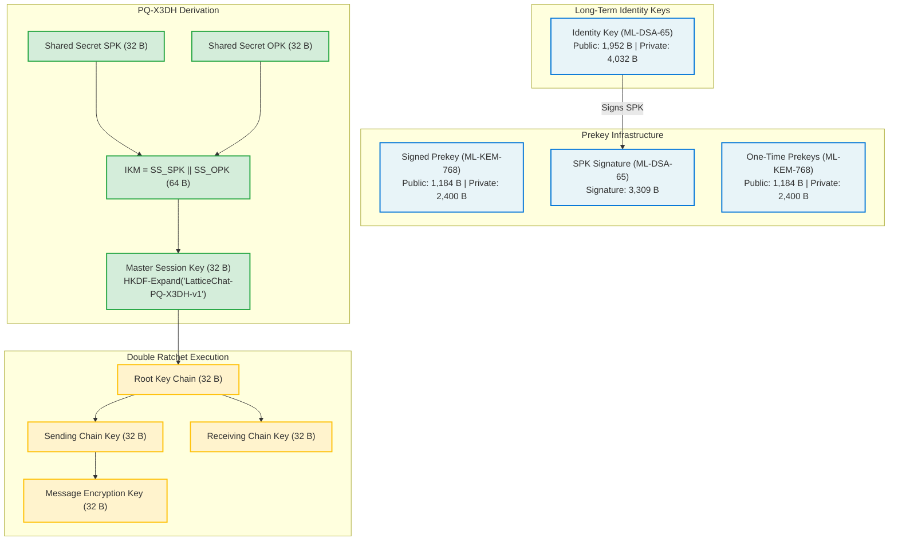
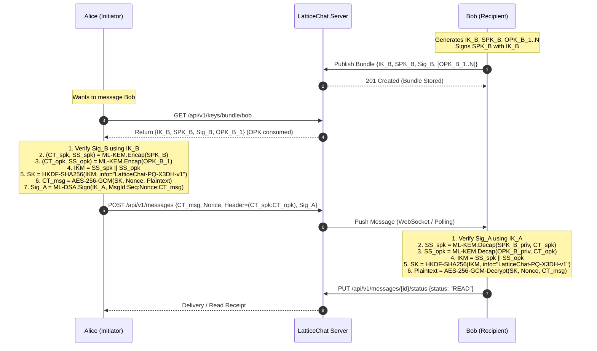
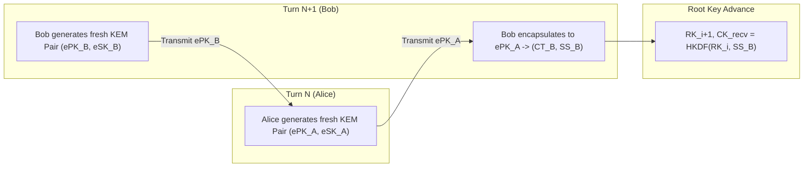
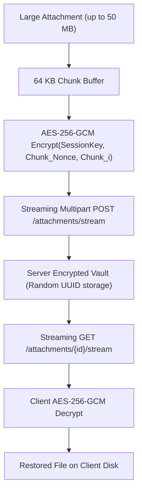

# LatticeChat — Post-Quantum Cryptographic Protocol Specification

**Standard Primitives**: NIST FIPS 203 (ML-KEM-768), NIST FIPS 204 (ML-DSA-65), NIST SP 800-38D (AES-256-GCM), RFC 5869 (HKDF-SHA256)  
**Version**: 1.0.0-PROD  
**Classification**: Protocol Technical Specification  
**Author**: Malhar Bhosale  

---

## 1. Protocol Architecture & Primitive Selection

LatticeChat replaces vulnerable classical Diffie-Hellman and elliptic-curve primitives with NIST-standardized module-lattice algorithms.

```
+-----------------------------------------------------------------------------+
|                          CRYPTOGRAPHIC SUITE MAP                            |
+-----------------------+-----------------------------+-----------------------+
| Purpose               | Standard / Primitive        | Security Level        |
+-----------------------+-----------------------------+-----------------------+
| Asymmetric Handshake  | NIST FIPS 203 ML-KEM-768    | NIST Level 3 (192-bit)|
| Digital Signatures    | NIST FIPS 204 ML-DSA-65     | NIST Level 3 (192-bit)|
| Symmetric Encryption  | AES-256-GCM (SP 800-38D)    | 256-bit Key / 96b IV  |
| Key Derivation        | HKDF-SHA256 (RFC 5869)      | HMAC-SHA-256 PRF      |
| Out-of-Band Auth      | Safety Number Fingerprint   | 60-Digit Visual Hash  |
+-----------------------+-----------------------------+-----------------------+
```

---

## 2. Key Hierarchy & Parameter Dimensions

All keys and payloads strictly conform to NIST FIPS 203 and FIPS 204 byte lengths:



---

## 3. Post-Quantum Extended Triple Diffie-Hellman (PQ-X3DH)

Classical X3DH calculates four Diffie-Hellman points: $DH_1 = DH(IK_A, SPK_B)$, $DH_2 = DH(EK_A, IK_B)$, $DH_3 = DH(EK_A, SPK_B)$, $DH_4 = DH(EK_A, OPK_B)$.  
Because **KEMs are asymmetric encapsulation primitives** rather than non-interactive Diffie-Hellman key exchanges, PQ-X3DH reorganizes key agreement into **authenticated dual-encapsulation** with identity signatures.

### Protocol Sequence Diagram:



### Mathematical Formulation:

1. **Prekey Verification**:
   $$\text{Valid} = \text{ML-DSA-65.Verify}(SPK_B, \sigma_{SPK_B}, IK_B)$$
   If $\text{Valid} \neq \text{true}$, abort session immediately.

2. **Dual Encapsulation**:
   $$(CT_{SPK}, SS_{SPK}) \leftarrow \text{ML-KEM-768.Encaps}(SPK_B)$$
   $$(CT_{OPK}, SS_{OPK}) \leftarrow \text{ML-KEM-768.Encaps}(OPK_B)$$
   where $|CT_{SPK}| = |CT_{OPK}| = 1,088 \text{ Bytes}$, and $|SS_{SPK}| = |SS_{OPK}| = 32 \text{ Bytes}$.

3. **Input Keying Material ($IKM$) Composition**:
   $$IKM = SS_{SPK} \parallel SS_{OPK} \quad (|IKM| = 64 \text{ Bytes})$$

4. **Key Derivation (RFC 5869)**:
   $$PRK = \text{HMAC-SHA256}(\text{salt}=\mathbf{0}^{32}, IKM)$$
   $$SK = \text{HKDF-Expand}(PRK, \text{info}=\text{"LatticeChat-PQ-X3DH-v1"}, L=32)$$

5. **Envelope Serialization**:
   $$\text{Header} = \text{Base64}(CT_{SPK}) \parallel \text{":"} \parallel \text{Base64}(CT_{OPK})$$

---

## 4. Post-Quantum Double Ratchet Specification

Following initial session establishment, communication progresses through a **Post-Quantum Double Ratchet** combining a symmetric KDF ratchet with an asymmetric KEM ratchet.

### 4.1 Symmetric KDF Ratchet (Per-Message Forward Secrecy)
For every message sent or received within an active ratchet epoch, the chain key advances:

$$(CK_{i+1}, MK_i) \leftarrow \text{KDF}_{\text{chain}}(CK_i)$$

where:
- $\text{KDF}_{\text{chain}}(CK) = (\text{HMAC-SHA256}(CK, \text{"0x01"}), \text{HMAC-SHA256}(CK, \text{"0x02"}))$
- $MK_i$ is used to encrypt or decrypt the $i$-th message via AES-256-GCM.
- **Zeroization**: $MK_i$ is scrubbed from memory with zeros immediately following use:
  $$\forall b \in MK_i : b \leftarrow 0$$

### 4.2 Asymmetric KEM Ratchet (Post-Compromise Security / Break-in Recovery)
To guarantee healing after a state compromise, the ratchet periodically performs an asymmetric KEM step when conversation turns occur:



1. Alice includes a newly generated ephemeral KEM public key $ePK_A$ in her message header.
2. Bob encapsulates against $ePK_A$, generating $(CT_B, SS_B) \leftarrow \text{ML-KEM.Encaps}(ePK_A)$.
3. Both parties advance the Root Key ($RK$):
   $$(RK_{i+1}, CK_{\text{new}}) \leftarrow \text{HKDF-Extract-and-Expand}(RK_i, SS_B)$$
4. Bob generates his own fresh $ePK_B$, transmitting it back to Alice.

---

## 5. Out-of-Band Safety Numbers (Authentication & Anti-MitM)

To guard against malicious key injection during initial registration, LatticeChat provides deterministic **Safety Numbers**:

### Derivation Algorithm:
1. Sort identity keys lexicographically:
   $$(IK_1, IK_2) = \begin{cases} (IK_A, IK_B) & \text{if } IK_A \le IK_B \\ (IK_B, IK_A) & \text{otherwise} \end{cases}$$
2. Compute SHA-512 digest:
   $$D = \text{SHA-512}(IK_1 \parallel IK_2)$$
3. Format digest into twelve 5-digit decimal blocks (60 digits total):
   $$\text{SafetyNumber} = B_1 \text{-} B_2 \text{-} B_3 \dots \text{-} B_{12}$$
   where each $B_i = \text{BigInteger}(D[i \cdot 4 \dots i \cdot 4 + 3]) \pmod{100000}$.
4. Encode into a QR code for in-person camera scanning.

---

## 6. Encrypted File Streaming Protocol

Large attachments are transferred without server plaintext disclosure using **Streaming AES-256-GCM**:



- **Chunk Size**: Fixed at 64 KB ($65,536 \text{ Bytes}$) for optimal L1/L2 cache utilization.
- **Nonce Derivation**: Base 96-bit nonce incremented monotonically per chunk to eliminate nonce reuse risk.
- **Path Sanitization**: Files are saved on server storage under synthetic UUIDs (`UUID.randomUUID().toString() + ".enc"`), neutralizing directory traversal attempts.

---

## 7. Wire Format & JSON DTO Framing

### 7.1 Encrypted Message Envelope (`SendMessageRequest`)
```json
{
  "recipientUsername": "bob",
  "messageId": "f81d4fae-7dec-11d0-a765-00a0c91e6bf6",
  "ciphertext": "B64_AES_GCM_CIPHERTEXT==",
  "nonce": "B64_96BIT_NONCE==",
  "ephemeralKemHeader": "B64_CT_SPK==:B64_CT_OPK==",
  "signature": "B64_ML_DSA_65_SIGNATURE==",
  "sequenceNumber": 1
}
```

### 7.2 Key Bundle Publication (`PublishKeyBundleRequest`)
```json
{
  "identityKey": "B64_ML_DSA_65_PUBLIC_KEY==",
  "identityAlgorithm": "ML-DSA-65",
  "signedPrekey": "B64_ML_KEM_768_PUBLIC_KEY==",
  "signedPrekeyAlgorithm": "ML-KEM-768",
  "signedPrekeySignature": "B64_ML_DSA_65_SIGNATURE==",
  "oneTimePrekeys": [
    {
      "keyId": 1,
      "publicKey": "B64_ML_KEM_768_OPK_1==",
      "algorithm": "ML-KEM-768"
    }
  ]
}
```
