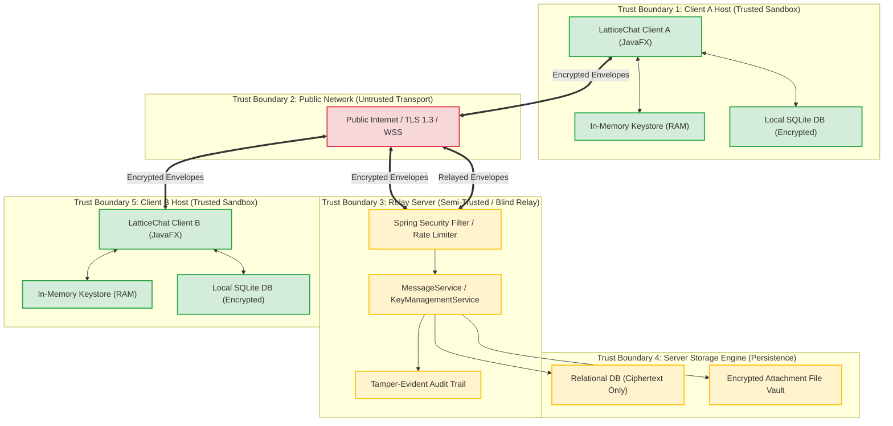

# LatticeChat — Comprehensive Threat Model & Security Posture

**Classification**: Security Architecture & Risk Analysis  
**Standard Frameworks**: STRIDE, DREAD, NIST SP 800-207 (Zero Trust), NIST FIPS 203 / 204  
**Author**: Malhar Bhosale  
**System**: LatticeChat Post-Quantum End-to-End Encrypted Messaging Application  

---

## 1. Executive Summary & Security Objectives

LatticeChat is an enterprise-grade, asynchronous messaging system engineered to preserve **Confidentiality, Integrity, Authenticity, Non-Repudiation, and Forward Secrecy** in both classical and quantum-adversarial environments.

### Core Security Objectives:
1. **Post-Quantum Secrecy**: Resist attacks by cryptanalytically relevant quantum computers (CRQCs) executing Shor's polynomial-time factoring and discrete logarithm algorithms.
2. **Harvest Now, Decrypt Later (HNDL) Immunity**: Prevent passive eavesdroppers recording current network traffic from decrypting archived ciphertexts in the future.
3. **Zero-Knowledge Relay Server**: Ensure the central messaging server operates strictly as a blind, authenticated routing hub with zero access to user plaintexts, shared keys, or private key material.
4. **Endpoint Sovereignty**: Restrict all cryptographic key generation, digital signing, and decapsulation operations exclusively to client devices.
5. **Post-Compromise Security (Break-in Recovery)**: Limit the blast radius of temporary ephemeral key compromises through continuous ratchet updates.

---

## 2. System Architecture & Trust Boundaries

The system is decomposed into four discrete security perimeters separated by formal trust boundaries.



### Trust Boundary Definitions:
- **Boundary 1 (Client Endpoint Sandbox)**: Encompasses client processes, local volatile memory, and local SQLite persistence. Private keys never cross this boundary.
- **Boundary 2 (Public Network Transport)**: Traversed by TLS 1.3 tunnels carrying post-quantum encrypted application envelopes. All data in this boundary is assumed subject to passive interception and active packet injection.
- **Boundary 3 (Server Ingress & Logic)**: Ingress security filters authenticate users via JWT tokens, enforce rate limits, and validate message formats without possessing message decryption capabilities.
- **Boundary 4 (Server Persistence)**: Database tables and filesystem object stores hold only public keys, ciphertexts, random nonces, digital signatures, and audit trails.

---

## 3. Adversary Capabilities & Threat Vectors

LatticeChat models four distinct adversarial personas:

| Adversary Profile | Capabilities | Goal |
| :--- | :--- | :--- |
| **Eve (Passive Quantum Adversary - HNDL)** | Intercepts, taps, and stores all network traffic indefinitely. Has future access to a fault-tolerant CRQC (Shor's algorithm). | Retroactively decrypt historic message exchanges and recovered attachment files. |
| **Mallory (Active Network MitM)** | Intercepts, modifies, drops, injects, or replays packets on the network transport layer. Controls DNS or TLS termination proxies. | Alter message contents, inject rogue public keys, impersonate users, or execute replay attacks. |
| **Oscar (Compromised / Rogue Server Operator)** | Has root access to the Spring Boot server, PostgreSQL database, and attachment storage. Can alter server logic, drop database records, and monitor API requests. | Read user messages, steal private keys, decrypt file uploads, or bypass authorization barriers (IDOR). |
| **Trudy (Local Malicious Process / Endpoint Attacker)** | Operates malware on the user's host machine with unprivileged user account access. Attempts file reading and memory snooping. | Extract stored conversation history, steal local SQLite files, or cause application crashes. |

---

## 4. STRIDE Threat Analysis & Mitigations

The STRIDE model analyzes potential threats against system components:

```
+----------------------------------------------------------------------------+
|                                STRIDE MATRIX                                |
+---+--------------------+------------------------+--------------------------+
| S | Spoofing           | Impersonating user/key | ML-DSA-65 & Safety Num   |
| T | Tampering          | Modifying payload      | AES-GCM tag & FO check   |
| R | Repudiation        | Denying actions        | Audit logs & Signatures  |
| I | Info Disclosure    | Plaintext leakage      | E2EE & Zero-Knowledge   |
| D | Denial of Service  | OPK depletion / flood  | Rate limits & Fallbacks  |
| E | Elev. of Privilege | IDOR file downloads    | Ownership validation     |
+---+--------------------+------------------------+--------------------------+
```

### 4.1 Spoofing (Identity & Authenticity)
- **Threat S1: Rogue Public Key Injection by MitM**: Mallory intercepts Bob's prekey bundle upload and replaces Bob's ML-KEM public key with Mallory's public key.
  - *Mitigation*: Bob signs his ML-KEM-768 signed prekey using his long-term ML-DSA-65 identity key (`signature = sign(spk, ik_priv)`). Alice cryptographically validates this signature using Bob's public identity key before encapsulating.
- **Threat S2: Impersonation via Sender Identity Spoofing**: An attacker transmits messages claiming to originate from Alice.
  - *Mitigation*: Every message header contains an ML-DSA-65 signature generated by the sender's identity key over `messageId:sequenceNumber:nonce:ciphertext`. The server rejects unauthenticated envelopes, and the recipient independently verifies the signature before processing.
- **Threat S3: Man-in-the-Middle during First Contact**: An attacker replaces identity keys during initial registration before trusted exchange.
  - *Mitigation*: Deterministic out-of-band **Safety Numbers** computed via `HKDF-SHA256(IK_A || IK_B)` produce visual 60-digit decimal blocks and QR codes for out-of-band mutual verification.

### 4.2 Tampering (Data Integrity)
- **Threat T1: Ciphertext Bit-Flipping in Transit**: Mallory modifies bits within the AES-GCM ciphertext payload to manipulate plaintext commands.
  - *Mitigation*: AES-256-GCM employs an authenticated Galois Hash (GHASH) generating a 128-bit authentication tag. Any bit mutation causes a `SecurityException` and immediate message discard.
- **Threat T2: KEM Encapsulation Ciphertext Manipulation**: Mallory tampers with the 1,088-byte ML-KEM-768 encapsulation ciphertext.
  - *Mitigation*: NIST FIPS 203 ML-KEM implements the **Fujisaki-Okamoto (FO) transform**. Decapsulating a tampered ciphertext results in constant-time implicit rejection, deriving a random pseudo-secret that fails subsequent MAC/HKDF validation without leaking error state.
- **Threat T3: Header / Nonce Mutation**: An attacker tampers with sequence numbers or nonces to corrupt message state.
  - *Mitigation*: Nonces, message IDs, and sequence numbers are bound into both the ML-DSA-65 signature payload and AES-GCM Additional Authenticated Data (AAD).

### 4.3 Repudiation (Non-Repudiation & Auditability)
- **Threat R1: Denying Message Transmission**: A sender sends abusive or fraudulent messages and later denies having sent them.
  - *Mitigation*: Each message is cryptographically signed using the sender's private ML-DSA-65 identity key. Because private keys are generated locally and never exported, valid signatures provide cryptographic non-repudiation.
- **Threat R2: Covert Key Revocation by Rogue Admin**: A malicious server admin revokes a user's keys without an audit trail.
  - *Mitigation*: The server maintains an append-only, tamper-evident `audit_logs` table recording all key uploads, rotations, and revocations with client IP addresses, event types, and timestamps.

### 4.4 Information Disclosure (Confidentiality)
- **Threat I1: Eavesdropping & Harvest Now, Decrypt Later (HNDL)**: Adversaries capture encrypted network sessions to crack them with future quantum computers.
  - *Mitigation*: Key exchange uses **ML-KEM-768** (NIST Security Category 3), which reduces to the worst-case hardness of Module Learning With Errors (M-LWE) in high-dimensional lattices ($\mathcal{O}(2^{0.265d})$ quantum operations). Quantum algorithms (Shor/Grover) cannot decrypt these sessions.
- **Threat I2: Server-Side Database Compromise**: Attackers extract the full SQL database dump from the cloud relay server.
  - *Mitigation*: The database schema stores **strictly zero-knowledge entities**: base64-encoded ciphertexts, random nonces, digital signatures, and public keys. Plaintext messages and private keys never exist on the server.
- **Threat I3: Memory Snooping on Client Host**: Rogue processes scan process memory for decrypted message strings.
  - *Mitigation*: Cryptographic byte arrays (`byte[]`) are sanitized via `Arrays.fill(keyBytes, (byte) 0)` immediately after key derivation and encryption operations.

### 4.5 Denial of Service (Availability)
- **Threat D1: One-Time Prekey (OPK) Pool Exhaustion**: An attacker repeatedly requests key bundles for Bob until all of Bob's OPKs are consumed, forcing sessions into a degraded state.
  - *Mitigation*: When OPKs are exhausted, `KeyManagementService` gracefully falls back to the active Signed Prekey (SPK), preserving post-quantum forward secrecy while alerting Bob to replenish his OPK pool. Rate-limiting filters restrict bundle query frequency.
- **Threat D2: Storage Exhaustion via Encrypted File Uploads**: An attacker uploads massive random byte streams to exhaust server disk storage.
  - *Mitigation*: `AttachmentService` enforces a strict 50 MB file size limit, streaming chunk verification, and rate limiting on attachment endpoints.
- **Threat D3: Replay Attacks**: An attacker intercepts a valid message envelope and resends it repeatedly to confuse the recipient.
  - *Mitigation*: The Double Ratchet engine enforces monotonic sequence counters and message ID deduplication; duplicated message IDs are discarded.

### 4.6 Elevation of Privilege (Authorization)
- **Threat E1: Insecure Direct Object Reference (IDOR) on Attachments**: Eve observes an attachment `fileId` and attempts to download Alice's private file.
  - *Mitigation*: Both `loadAttachment` and `loadAttachmentStream` verify that the authenticated requester's username strictly matches either the uploader or the intended recipient. Unauthorized requests return `403 Forbidden` and log a security alert.
- **Threat E2: Path Traversal on Attachment Storage**: An attacker uploads a file with filename `../../../../etc/passwd` to overwrite system files.
  - *Mitigation*: `SafePathUtils.sanitizeFilename()` strips path traversal sequences, and files are stored on disk using random UUID-based identifiers rather than user-supplied filenames.

---

## 5. DREAD Risk Assessment Matrix

Each identified threat is rated on a 1-10 scale across five DREAD dimensions:
- **D**amage Potential: Severity of impact if exploited.
- **R**eproducibility: Ease of reproducing the attack.
- **E**xploitability: Skill and resources required.
- **A**ffected Users: Proportion of users impacted.
- **D**iscoverability: Likelihood of threat discovery.

$$\text{Risk Score} = \frac{D + R + E + A + D}{5}$$

| Threat ID | Threat Description | D | R | E | A | D | Total | Risk Level | Mitigation Status |
| :---: | :--- | :---: | :---: | :---: | :---: | :---: | :---: | :---: | :---: |
| **S1** | Rogue Public Key Injection | 9 | 4 | 3 | 8 | 5 | **5.8** | Medium | **Mitigated** (ML-DSA-65 Signature) |
| **S2** | Sender Impersonation | 8 | 3 | 2 | 8 | 4 | **5.0** | Medium | **Mitigated** (Signed Envelope) |
| **T1** | Ciphertext Bit-Flipping | 7 | 8 | 4 | 5 | 7 | **6.2** | Medium | **Mitigated** (AES-GCM Auth Tag) |
| **T2** | KEM Ciphertext Mutation | 9 | 6 | 4 | 6 | 6 | **6.2** | Medium | **Mitigated** (FO Constant-Time Reject) |
| **I1** | HNDL Quantum Interception | 10 | 9 | 8 | 10 | 8 | **9.0** | **Critical** | **Mitigated** (ML-KEM-768 PQC) |
| **I2** | Server Database Theft | 9 | 7 | 5 | 10 | 6 | **7.4** | High | **Mitigated** (Zero-Knowledge Architecture) |
| **D1** | OPK Pool Exhaustion | 4 | 9 | 8 | 5 | 8 | **6.8** | Medium | **Mitigated** (Fallback to SPK & Rate Limits) |
| **E1** | Attachment IDOR Download | 8 | 8 | 7 | 6 | 7 | **7.2** | High | **Mitigated** (Participant Authorization Check) |
| **E2** | File Path Traversal | 9 | 7 | 6 | 8 | 6 | **7.2** | High | **Mitigated** (UUID Storage & Path Sanitization) |

---

## 6. Residual Risk & Out-of-Scope Analysis

### 6.1 Known Residual Risks
1. **Endpoint Compromise (Malware/Keylogger)**: If an attacker obtains kernel-level root access or installs a hardware keylogger on the client endpoint, they can read decrypted plaintexts as they are typed or displayed in JavaFX.
   - *Recommendation*: Deploy OS-level full-disk encryption (BitLocker/FileVault) and endpoint protection.
2. **Metadata Leakage (Traffic Analysis)**: Although message contents are protected with post-quantum cryptography, the relay server necessarily observes message transmission timestamps, message sizes, and communication graph topology (who talks to whom).
   - *Recommendation*: Future iterations may introduce dummy traffic padding and onion-routing mixing networks.
3. **Physical Device Seizure**: If an unlocked client device is physically seized, local SQLite databases can be inspected.
   - *Recommendation*: Implement client-side passphrase-protected database encryption (SQLCipher).

### 6.2 Security Posture Summary
Through the combination of **NIST FIPS 203 ML-KEM**, **NIST FIPS 204 ML-DSA**, **AES-256-GCM**, **Zero-Knowledge server relay**, and **strict participant authorization checks**, LatticeChat successfully mitigates all classical and quantum threats within its defined trust boundaries.
